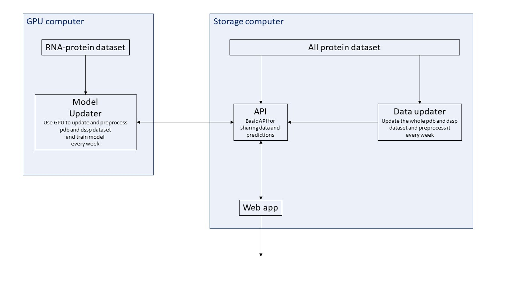

# Modeling protein-RNA interactions with GCNN

[](https://travis-ci.org/AGregorc/protein-RNA-iteractions)

 ... *description* ...


# Installation

Clone the code

```
git clone https://github.com/AGregorc/protein-RNA-iteractions.git
```

Now there is an option to use anaconda or pip to install all the requirements.
The preferred one is using anaconda since it provides cudatoolkit.

#### Using Anaconda
 
Check conda installation guides. 
Here is just one example how to install miniconda on linux

```
wget https://repo.anaconda.com/miniconda/Miniconda3-latest-Linux-x86_64.sh
sha256sum Miniconda3-latest-Linux-x86_64.sh
bash Miniconda3-latest-Linux-x86_64.sh
rm Miniconda3-latest-Linux-x86_64.sh
source miniconda3/bin/activate

conda create -n torch python=3.7
conda activate torch
```
Move to the protein-RNA-iteractions directory eg. `cd protein-RNA-iteractions` and then
```
conda install --file requirements.txt -c pytorch -c dglteam -c conda-forge
```

# Usage 

### Training models

To train models we need to load pdb and dssp data and preprocess it.
To load and preprocess data from `data/pdbs.lst` run `python src/main.py create`.
For training models run `python src/main.py train`. The default used model is 
`two_branches_small` but it can be manually changed it via `model_names` variable inside `main` function
of `src/main.py` script.  

The `src/main.py` script can also do bunch of other things eg. tune weight parameter for 
`nn.CrossEntropyLoss`, visualize models and metrics and compute feature importance. 
All this can be done with `python src/main.py` and one of this additional arguments: `tune`, 
`visualize_models`, `visualize_metrics` or `feature_importance`.

#### Plot with matplotlib

To plot one pdb crystal using matplotlib you can see `src/data/PlotMPL.py` script.
Here we provide 2 examples how to call functions  `plot_from_file` and `plot_predicted`:

*  `plot_from_file('1a1t.pdb', lambda atom: None, load_feat_word_to_ixs(GENERAL_WORD_TO_IDX_PATH))`
*  `plot_predicted('1a1t.pdb', model, word_to_ixs)`

### Runing processes and user interface



The scheme above shows our default processes structure.
All processes are packaged into separate docker images.

TODO: how to run docker images

